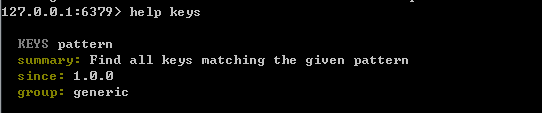

Redis学习笔记
=====================================
先进的Key-Value持久化产品
数据结构服务器
存储的值可以为：String，哈希（Map），列表（List），集合（sets）,有序集合（sorted sets）

####常用命令集合
1. 服务启动及连接：
	Windows和Unix的安装不做说明，启动都是运行server
	`Win：{$path}/redis-server.exe redis.conf, Unix: /src/redis-server redis.conf`
	`/src/redis-server redis.conf 1>log.log 2>errlog.log`
	第二条命令的1,2分别是标准输出和错误输出
2. 利用客户端连接Redis,格式如下：
	`.../redir-cli(.exe) -h 127.0.0.1 -p 6379`

命令帮助（Enlish）,查看命令格式及返回信息
	`help {cmd}` 如: `help keys`
	
#####KEY 相关的命令
1. [exists](#) *key*
	检查key是否存在
2. [keys](#) *pattern*   :	`keys *` `keys a*` `keys a??` `keys aaa` 匹配各种模糊及确切情况
3. [del](#) *key [key ...]*
	删除给定的Key或多个key， 返回被删除 key 的数量
4. [dump](#) *key*
